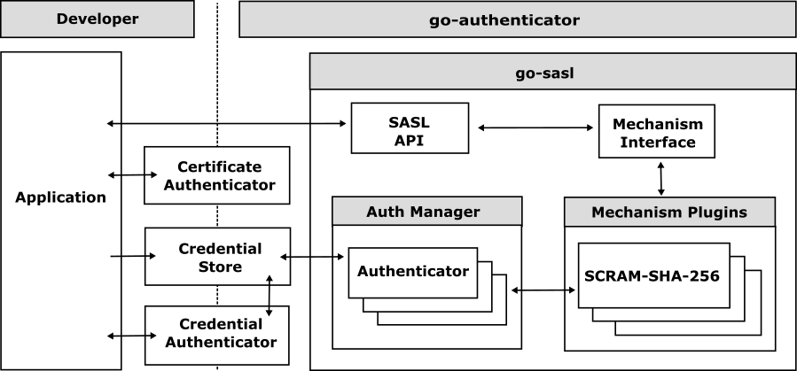

# go-authenticator

  
 

The `go-authenticator` is a open source framework for authenticating users in Go applications. It supports multiple authentication methods, including user and password authentication, SASL (Simple Authentication and Security Layer) authentication, and certificate authentication.

The `go-authenticator` framework is designed to be flexible and extensible, allowing you to easily integrate it into your existing applications. 

## Features

The `go-authenticator` framework provides the following features:

- **User Authentication**: Authenticate users using user and password.
- **SASL Authentication**: Authenticate users using SASL (Simple Authentication and Security Layer).
- **Certificate Authentication**: Authenticate users using certificate of TLS connection.

## Getting Started

### User Authentication

### SASL Authentication

The `go-authenticator` framework includes the `go-sasl` package, which provides a set of SASL (Simple Authentication and Security Layer) mechanisms that can be used to authenticate users in Go applications. For information on how to use the SASL API, see the go-sasl documentation.

- [go-sasl](https://github.com/cybergarage/go-sasl)

#### Examples

- [go-mongo](https://github.com/cybergarage/go-mongo)
  - [BaseCommandExecutor::ExecuteCommand()](https://github.com/cybergarage/go-mongo/blob/master/mongo/command_base_executor.go)

### Certificate Authentication

#### Examples

- [go-mongo](https://github.com/cybergarage/go-mongo)
  - [Server::serve()](https://github.com/cybergarage/go-mongo/blob/master/mongo/server.go)
